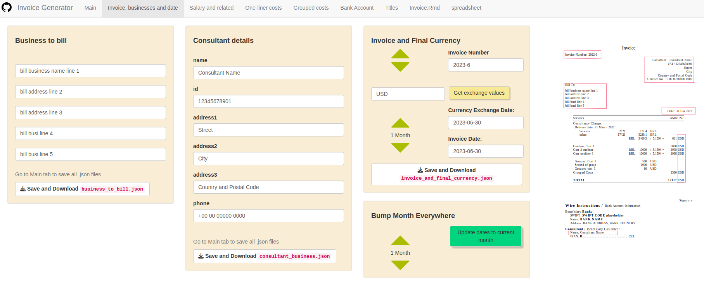

# Shiny App Submodule from shinyInvoice R-Package

Package Repository: https://github.com/fernandoroa/shinyinvoice

## Invoice Creation with Shiny and RMarkdown

This repository modifies https://github.com/shubham-maurya/shiny-invoice-generator/

It has lots of modifications, and now it is for single person use.

### Files

1. The `app/main.R` module file is the Shiny interface to the invoice generator, which has inputs (boxes) corresponding to
   `.json` information. Each panel/box and its logic are handled in submodules.

2. The `invoice.Rmd` file is the RMarkdown file, which you can modify to suit your own particular invoice. This file also
   processes data.

3. each `.json` file can be updated in the app. The act of downloading or rendering the `.pdf` saves changes that, otherwise
   can be discarded by buttons for that purpose.

### Inner logic

- A couple of inputs are passed to the `.Rmd` via `params` in `yaml` header.
- Other inputs/boxes are held in `.json` files upon saving.
- The `.Rmd` reads the `.json` files directly.
- The `reload` button discards unsaved changes.
- Includes oneliner costs and grouped costs
- Includes bilingual option
- Names or Titles in the `.pdf` depend on the `fieldNames.json`, which allows the bilingual option, see the Ace editor tabs.

### Exchange rates

- Salary values, one-liner and grouped costs can be in a different currency.
- It is possible to get a exchange rate for a defined date, for those.
- Package `quantmod` and function `getSymbol` is used for the exchange.

### inputs' check-boxes

- The table consists of 3 big blocks:

  - Salary
  - Oneliners
  - Grouped costs

- Not only those parts can be selectively used with check-boxes but also
  parts of them

### Demo Link

https://ferapps.shinyapps.io/open-invoice/

### Disclaimer (shinyapps.io demo link)

Shinyapps.io (demo) uses the same filesystem for every user. This app uses temporary folders for your data,
and you can explicitly remove the temporary folder of your session with the `Reset` button.
As this app allows for uploading an .Rmd file with R code or other content, the shinyapps.io app is vulnerable, despite
measures taken to protect users data.

### Running the app

- Clone this repository and set as working folder in R.
- In R run:
  - `rhino::app()` or
  - `shiny::runApp()`

#### How to run in a local folder

- Clone this repository and set as working folder in R.

```
# Read the main file
main <- readLines("app/main.R")

# Change string to use the local mode
main <- sub("local_safe_computer_mode <- FALSE", "local_safe_computer_mode <- TRUE", main)
writeLines(main, "app/main.R")
shiny::runApp()
```

This way when you save changes or do any download action your files will be (also) in the local folder:

```
app/tmp_dir/
```

### UI


